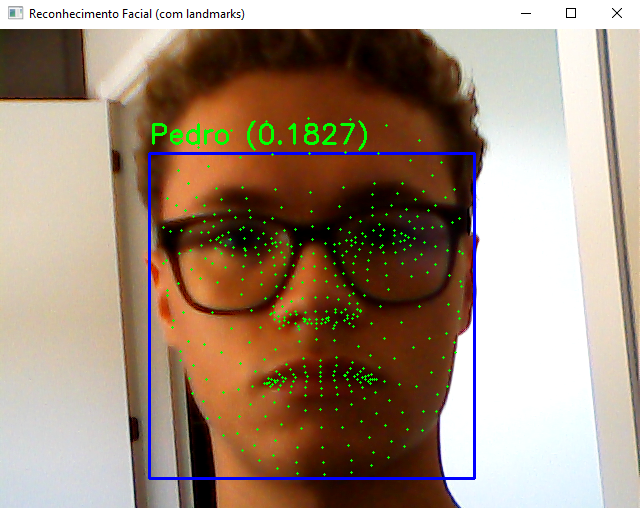
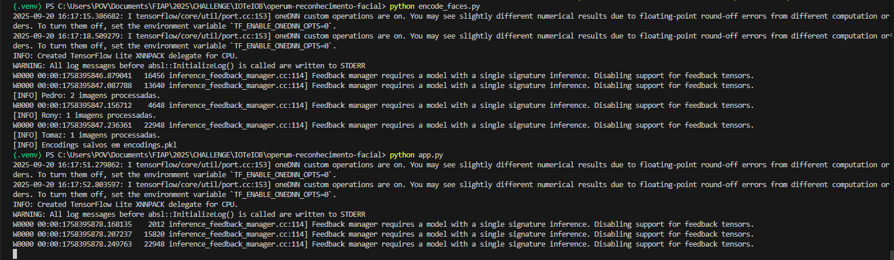

# 👁️ Reconhecimento Facial com OpenCV + MediaPipe

## 📌 Objetivo
Este projeto tem como objetivo desenvolver uma aplicação **local (desktop/notebook)** que realiza **reconhecimento e identificação facial** de usuários.  
A detecção é feita em tempo real usando **MediaPipe** e **OpenCV**, permitindo a exibição de retângulos, landmarks e identificação de pessoas conhecidas.  

Projeto desenvolvido no contexto da disciplina **IoT & IOB (FIAP - 2025)**.

---

## 🛠️ Tecnologias utilizadas
- [Python 3.12](https://www.python.org/)  
- [OpenCV](https://opencv.org/) → captura de vídeo e processamento de imagens  
- [MediaPipe](https://developers.google.com/mediapipe) → detecção facial e landmarks  
- [Pickle](https://docs.python.org/3/library/pickle.html) → armazenamento de embeddings faciais  

---

## 📂 Estrutura do projeto
├── dataset/ # Imagens de referência por pessoa
│ ├── Pedro/
│ │ ├── pedro1.jpeg
│ │ ├── pedro2.jpeg
│ ├── Rony/
│ │ ├── rony1.jpeg
│ │ ├── rony2.jpeg
│ └── Tomaz/
│ ├── tomaz1.jpeg
│ ├── tomaz2.jpeg
│
├── app.py # Executa reconhecimento facial em tempo real
├── encode_faces.py # Processa imagens e gera embeddings salvos em encodings.pkl
├── encodings.pkl # Arquivo gerado com embeddings
├── requirements.txt # Dependências do projeto
└── README.md # Documentação do projeto


---

## ⚙️ Instalação e execução
### 1️⃣ Clonar o repositório
```bash
git clone https://github.com/SEU-USUARIO/operum-reconhecimento-facial.git
cd operum-reconhecimento-facial

### 2️⃣ Criar e ativar ambiente virtual
```bash
python -m venv .venv
.\.venv\Scripts\activate   # Windows
source .venv/bin/activate  # Linux/Mac

### 3️⃣ Instalar dependências
```bash
pip install -r requirements.txt

### 4️⃣ Preparar o dataset
```bash
dataset/
 └── Pedro/
     ├── foto1.jpg
     └── foto2.jpg

### 5️⃣ Gerar embeddings
```bash
python encode_faces.py

### 6️⃣ Rodar reconhecimento facial
```bash
python app.py

---

## 🎛️ Parâmetros ajustáveis
- **`min_detection_confidence`** → ajusta a confiança mínima para detecção (0.1 → detecta mais rostos mas pode errar, 0.9 → mais preciso porém exige qualidade).  
- **`model_selection`**  
  - `0` → recomendado para rostos próximos (selfies).  
  - `1` → recomendado para rostos mais distantes.  
- **Tamanho do embedding** → atualmente redimensionado para **128x128 pixels**.  

---

## 📹 Demonstração em vídeo
🔗 *(Adicionar link do vídeo explicativo após gravação – até 3 min)*  

O vídeo deve cobrir:  
✔️ Contexto e problema  
✔️ Tecnologias escolhidas  
✔️ Ajuste de parâmetros e impacto no resultado  
✔️ Funcionamento prático  
✔️ Limitações e próximos passos  

---

## 📸 Evidências / Prints Técnicos

### Estrutura do projeto


### Reconhecimento facial em tempo real


### Código em execução


---

## ⚖️ Nota ética
Este projeto tem finalidade **exclusivamente acadêmica**.  
Dados faciais são informações sensíveis e devem ser tratados com **segurança, consentimento e privacidade**.  
Não utilize este código em ambientes de produção sem considerar a **LGPD** e outras legislações aplicáveis.  

---

👨‍💻 Desenvolvido por [Seu Nome] - FIAP 2025

